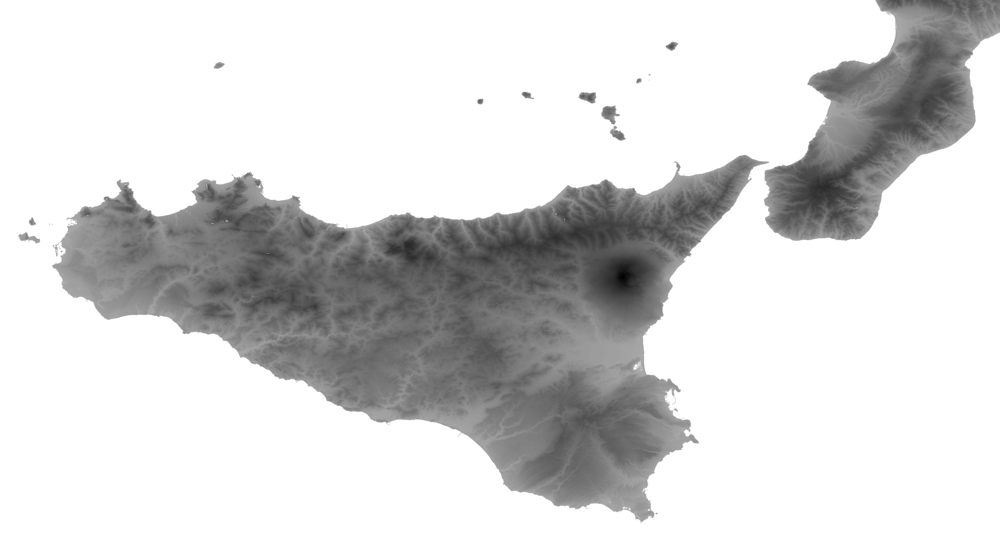

# `hgt2pnm` -- Converting HGT files to PNG images

HGT files are data about elevation (Digital Elevation Model, or DEM) provided by NASA.  You can download them [here](https://dds.cr.usgs.gov/srtm/version2_1/).

The documentation is available [here](https://dds.cr.usgs.gov/srtm/version2_1/Documentation/).

Basically, they are an image representation of Earth: each pixel represents 1 or 3 meters (depending on the regions) and contains an elevation value.

They are "provided as 16-bit signed integer data in a simple binary raster."  The "byte order is Motorola ("big-endian") standard with the most significant byte first." ([doc](https://dds.cr.usgs.gov/srtm/version2_1/Documentation/SRTM_Topo.pdf)).  This means that they cannot be exploited as is, and need to transformations.

This repository contains programs to read and modify them.  Please check out [my `elevation_map` directory](https://github.com/boberle/elevation_map) for maps in color.

## `hgt2pnm`: get an image

This program read an HTG file and outputs a pgm image, that you can convert to other formats.  Here is an example of the Bay of Naples, with the Mount Vesuvius:


And the whole island of Sicilia, with the Mount Etna (tiles have been concatenated with GIMP):



To compile and run:

```bash
gcc -lm hgt2pnm.c -o hgt2pnm
./hgt2pnm <infile>.hgt <outfile>.pgm
```


## `hgt2hex`: print the hexadecimal values

This program print the hexadecimal values of the tiles.  For example:

```
0166 016B 0172 017C 017F 0183 0184 0180 0181 0187 018D
0191 0197 0198 01A1 01A9 01AF 01B6 01BB 01BB 01BA 01BB
01BE 01C6 01CE 01D1 01D2 01CD 01C8 01C2 01C0 01C0 01BD
...
```

For 3-meter resolution tiles, there are 1201 rows and 1201 columns.


## `hgt2little_endian`: convert to little endian

HGT files are big endian byte order.  This program convert them to
little endian.

Here is the relevant part of the [documentation](https://dds.cr.usgs.gov/srtm/version2_1/Documentation/SRTM_Topo.pdf):

> 3.1 DEM File (.HGT)
>
> The DEM is provided as 16-bit signed integer data in a simple binary raster.  There are no header or trailer bytes embedded in the file. The data are stored in row major order (all the data for row 1, followed by all the data for row 2, etc.).
>
> All elevations are in meters referenced to the WGS84/EGM96 geoid as documented at http://www.NGA.mil/GandG/wgsegm/.
>
> Byte order is Motorola ("big-endian") standard with the most significant byte first. Since they are signed integers elevations can range from -32767 to 32767 meters, encompassing the range of elevation to be found on the Earth.
>
> These data also contain occassional voids from a number of causes such as shadowing, phase unwrapping anomalies, or other radar-specific causes. Voids are flagged with the value -32768.
>
> 4.1 Data Encoding
>
> Because the DEM data are stored in a 16-bit binary format, users must be aware of how the bytes are addressed on their computers. The DEM data are provided in Motorola or IEEE byte order, which stores the most significant byte first ("big endian"). Systems such as Sun SPARC, Silicon Graphics workstations and PowerPC Macintosh computers use the Motorola byte order. The Intel byte order, which stores the least significant byte first ("little endian"), is used on DEC Alpha systems, most PCs and MAcintosh computers built after 2006. Users with systems that address bytes in the Intel byte order may have to "swap bytes" of the DEM data unless their application software performs the conversion during ingest. 


